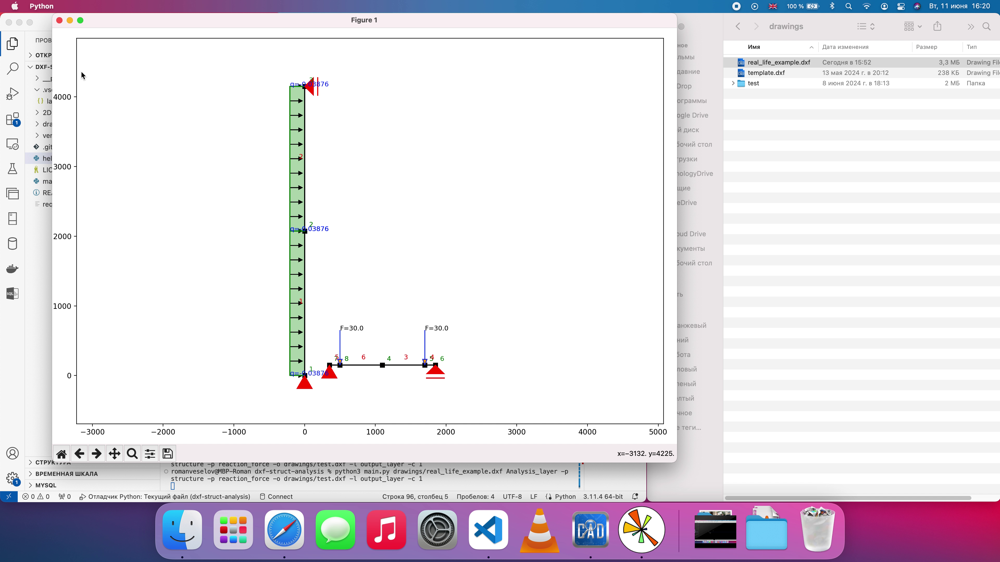

# EZstruct
#### Description:

EZstruct covers needs of structural engineer in simple 2D static calculator. Preparation for stucture calculating can be executed right in CAD environment within dxf file. Output can be shown as Matplotlib figures. Displacements of each vertices of structure can be added to new or existing dxf file.
***

#### Installation Instructions:
Use `pip3 install -r reqirements.txt` to install all necessary libraries.

Core libraries are: [ezdxf](https://github.com/mozman/ezdxf/tree/master) and [anastruct](https://github.com/ritchie46/anaStruct/tree/master)
***

#### Preparation:
Start new DXF file or use existing one. Draw structure in a separate layer designated for analysis. 

Structure consist of: elements, supports, loads.
Supports and loads blocks has to be taken from dxf template (watch folder `drawings/`). Adjust CAD units before using template (template is unitless). Drawing can be performed within tolerance of 1e-6. Use all necessary objects to create structure:

1. Elements. To create wire model user allowed to use LINE and POLYLINE entities only. All other (3D POLYLINES, SPLINES, etc) will be skipped. Overlapped (start and end points of segments are same) elements will be skipped. If two elements intersect - it should be at least one vertex in the intersection. Coloring of elements is used to assign material. For material parameters assignment TEXT, MTEXT or block 'materials' (most prefferable, watch template) can be used (if no assignment - default values are used). Parameters set should be colored corresponding to elements. Parameters of material needed: Young’s modulus (E), Cross-Section Area (A), Moment of Inertia (I). Make sure you use the same linear units as model use. If using text, it should contain following pattern:
- 'E' or 'A' or 'I' char ->
- '=' or ':' or ' ' char (it could match char alone or a combination) ->
- digital value (might include thousands separators ',', decimal points '.') ->
- zero or more word characters (letters, digits, or underscores).
It is optional and is used to capture any kind of unit or identifier that might follow the numerical value without any space.

2. Supports. In template supports are represented as blocks. There is 3 types: fixed, hinged, roll supports. Visual part of a block (in block editor), scale, mirror state can be changed. Parameters that program use are: block name, insertion point, rotation of the block (for roll support).

3. Loads. In template loads are represented as blocks with attributes. There is 3 types: point, q-load, moment loads. You can type load values in block attribute (make sure you use the same units as used in model and parameters). Parameters that program uses are: block name, insertion point, attribute state. Also for:
- point load: inner block "Arrow" rotation state is used
- q-load: inner block "Arrow" rotation state, defpoint line start/end point is used
- moment load: block flip state is used

Visual part of a block "Arrow", "Arrowhead" can be changed (e.g. in block 'Arrow' custom arrow can be drawn).
- NOTE! You might scale loads blocks manually or using annotation scales. When using annotation scale make sure there is only one scale assigned to the block.

Save file after all preparations.
***

#### Usage:
On startup two mandatory arguments for CLI  are used: path to the file and layer of analysis.
You can use print option to view results.

All avaliable figures are:
- all_results
- structure
- reaction_force
- axial_force
- shear_force
- bending_moment
- displacement

Example: `python3 main.py drawings/test_all_good.dxf 0 -p reaction_force -p bending_moment`

You can use option to draw displacements. It is possible to draw them separate file `-o [filname]`, separate layer `-l [layername]` or both.

Example: `python3 main.py drawings/test_all_good.dxf Analysis_layer -o draw.dxf -l 123`

Use `python3 main.py --help` to see more options.
***

#### Roadmap:
- [ ] setting a rotational spring or a hinge on the element
- [ ] adding support spring
- [ ] adding uneven q-load
- [ ] adding dead load
- [ ] saving figures
- [ ] integration of an automatic unit convertion
- [ ] integration of a calculator as an autocad lisp
***

#### Example:

***

#### Files:
- **main.py:** The main executive file
- **helpers.py:** Contains test functions
- **drawings/template.dxf:** Contains data about requests